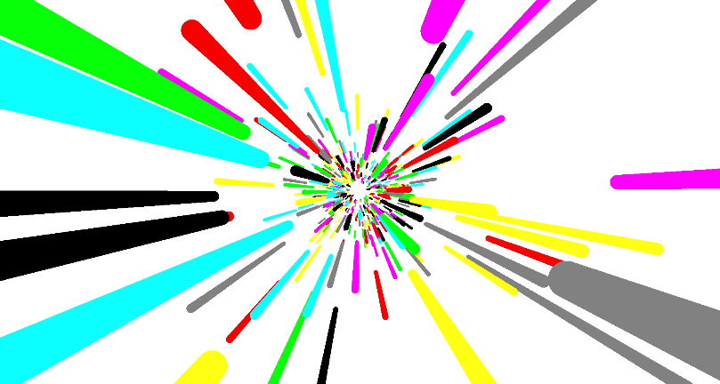

# Link Start


This rep is based on OpenGL, simply generate a Link Start effect:




### Build

```
# python 3.6
sudo apt-get install freeglut3
sudo apt-get install freeglut3-dev
pip3 install pyopengl pyopengl_accelerate opencv_python numpy
```


Here I want to share some problems I met:

1. In OpenCV the color channel is **BGR** not RGB
2. The frame get by glReadPixels is upside down, and the result is in bytes type.


V2:

​	Add motion blur, need to speed up ...